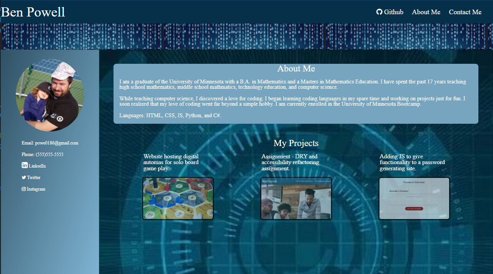

use.

<!-- PROJECT LOGO -->
 

  

<h3 align="center">Ben Powell - Portfolio</h3>
     
    <a href="https://github.com/powe0186/portfolio"><strong>Explore the docs »</strong></a>
     
     
    <a href="https://powe0186.github.io/portfolio/">View Demo</a>
    ·
    <a href="https://github.com/powe0186/portfolio/issues">Report Bug</a>
    ·
    <a href="https://github.com/powe0186/portfolio/issues">Request Feature</a>

<!-- TABLE OF CONTENTS -->

  
Table of Contents

  <ol>
    <li>
      <a href="#about-the-project">About The Project</a>
      <ul>
        <li><a href="#built-with">Built With</a></li>
      </ul>
    </li>
    <li>
      <a href="#getting-started">Getting Started</a>
      <ul>
        <li><a href="#prerequisites">Prerequisites</a></li>
        <li><a href="#installation">Installation</a></li>
      </ul>
    </li>
    <li><a href="#usage">Usage</a></li>
    <li><a href="#roadmap">Roadmap</a></li>
    <li><a href="#contributing">Contributing</a></li>
    <li><a href="#license">License</a></li>
    <li><a href="#contact">Contact</a></li>
    <li><a href="#acknowledgments">Acknowledgments</a></li>
  </ol>

<!-- ABOUT THE PROJECT -->
## About The Project

A website housing the coding portfolio of Ben Powell. Includes contact links for Twitter, Facebook, LinkedIn, email,
and phone number. Has links and short descriptions of projects Ben has worked on.

(<a href="#top">back to top</a>)

### Built With

* [html]
* [JavaScript]

(<a href="#top">back to top</a>)

<!-- USAGE EXAMPLES -->
## Usage

(<a href="#top">back to top</a>)

See the [open issues](https://github.com/github_username/repo_name/issues) for a full list of proposed features (and known issues).

(<a href="#top">back to top</a>)

(<a href="#top">back to top</a>)

<!-- CONTACT -->
## Contact

Your Name - [@powe0186](https://twitter.com/pow0186) - powe0186@gmail.com

Project Link: [https://github.com/powe0186/portfolio](https://github.com/powe0186/portfolio)